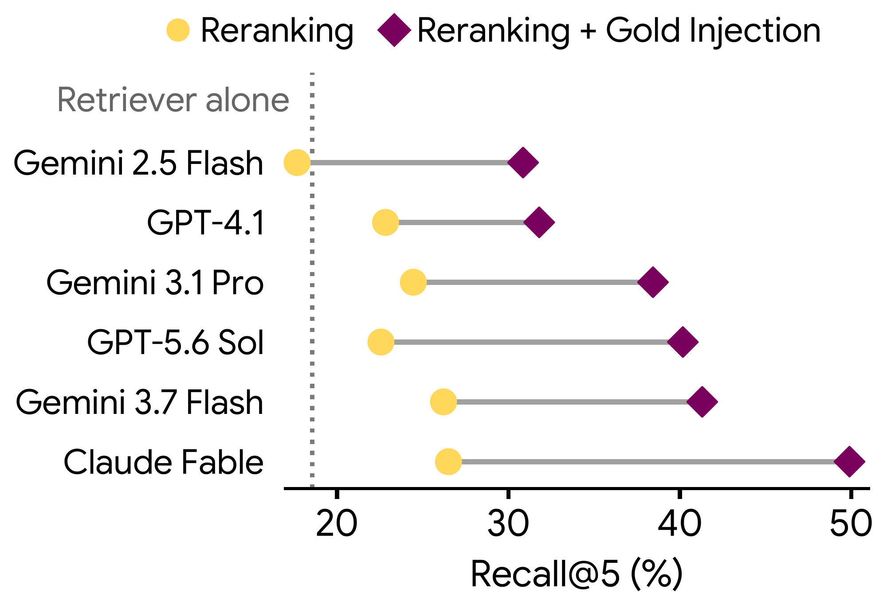

# ScholarCatalyst：论文检索先要找得到关键材料

作者：Kim, Sohyeon、Lee, Yoonho、Liu, Bo、Ko, Dayoon、Shao, Rulin、Kim, Seungone、Neubig, Graham、Koh, Pang Wei、Chowdhery, Aakanksha、Asai, Akari、Khattab, Omar、Choi, Yejin、Kim, Gunhee、Finn, Chelsea。arXiv:2610.02202 v1，提交2026-10-01。预印本。

新近创新 / 新近实用；热度待验证。已读核心原文，本站未训练复现。

科研检索需要的是“这篇文章能帮我推进当前问题”，并不等同于标题相似或最终被引用。ScholarCatalyst 收集 184 位研究者的 207 个项目，形成 207 个核心问题、687 个子问题与约 19 万篇候选文献，并附研究者的相关性理由。语料按项目时间做过滤，减少把未来论文用于解释过去研究的机会。

主实验限制检索系统使用给定语料，比较 BM25、稠密检索与代理方法，而不是开放全网搜索。在表 3 中，Qwen-8B 检索的 CoreQ/SubQ Recall@20 为 0.37/0.51，GPT-4.1 工具代理为 0.37/0.43，o3 深度代理为 0.33/0.38。这里不能据此推断所有真实科研任务都不需要代理：语料、问题、工具预算和时间限制都参与了结果。

作者进一步在 50 个核心问题和 50 个子问题上，把缺失的正确候选替换进固定大小的候选集合，再测试重排序。能力更强的重排模型从这项“正确候选注入”中获得更大收益，说明先前没找进候选池的论文，会限制后续推理。注入使用已知相关答案，是诊断用的理想条件，不是可部署的检索技巧。

为什么现在值得看：它把科研助手的失败拆成“没召回”和“召回后没选对”，可以直接指导评测设计。局限是研究者事后回忆仍有偏差，项目与领域覆盖也不均匀；论文同时区分了时间截点前后的模型，复现时应保持这一边界。

Sohyeon Kim 等，论文 Figure 6 正确候选注入实验原图：看同一重排序器在普通候选与加入已知相关候选后的差异。纵轴为 Recall@5；这是诊断召回瓶颈的受控实验，不是上线后的自动提升。整图引用，CC BY 4.0。（[作者原图](https://arxiv.org/abs/2610.02202v1)；[查看大图](../../../frontiers/2026/10/2026-10-03/images/paper-scholar.png)。）

[原始论文](https://arxiv.org/abs/2610.02202v1) · [版本许可](http://creativecommons.org/licenses/by/4.0/)

原文为CC BY 4.0，保存未改动的v1 PDF并保留作者和许可。
[归档PDF](2610.02202v1.pdf)

[返回本期论文精选](../../../frontiers/2026/10/2026-10-03/03-论文精选.md)
