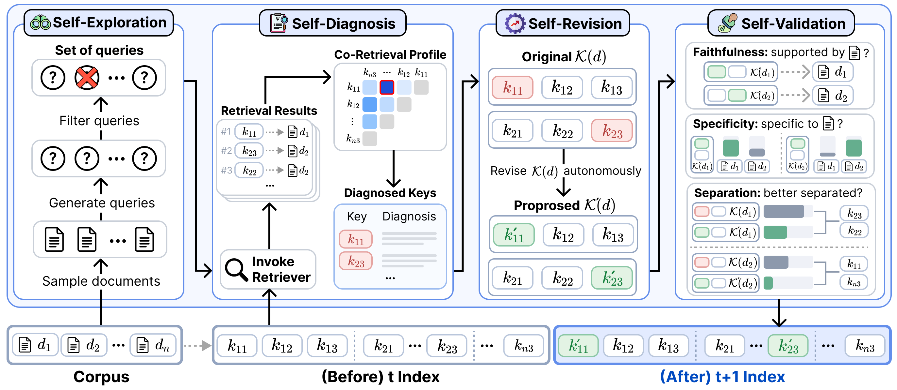

# Self-Index：文档不动，改进它被搜索到的方式

作者：Lee, Sangam、Lee, Wonjae、Kim, Sunghwan、Kim, Deogyong、Kim, Jaehoon、Nam, Daye、Kang, SeongKu、Lee, Dongha。arXiv:2609.19656 v1，2026-09-17；按预印本阅读，不宣称录用。

[原始论文](https://arxiv.org/abs/2609.19656v1) · [版本许可](http://creativecommons.org/licenses/by/4.0/)

入选：新近创新，热度待验证。已读原文核心方法与结果；本站未复现训练或大型评测。

Self-Index不直接重写原始文档，而是维护每篇文档可被检索的索引键。先模拟多种查询、观察哪些相关材料没有一起被找到，再提出局部键修改；通过忠实性、具体性与区分性检查后才接受。原始文本对应的键保持不变，因此增强检索与修改事实被分开处理。

方法的关键在闭环，而非一次性给文档生成几个问题。优化器根据共同检索不足等现象诊断，再尝试更能表达信息的键；查询模拟器也过滤过度相似的问题。正式实验的索引演化使用模拟查询，留出的评测问题不参与迭代，避免把已知答案直接写进索引。

作者以同一生成底座比较Doc2Query、SPIKE、RLIndex等方法，并检查BM25、BGE与Qwen嵌入检索器。在BRIGHT中，Qwen检索器平均nDCG@10由18.8升至26.1，是7.3个绝对点，作者报告约38.8%相对提升；并非所有子任务都最好。长记忆的一些易错子集甚至下降，说明重写键可能改变不同查询的收益分布。

主要结果对多次运行取均值，但离线构建索引仍需付费生成与验证，不能只看在线少调用几次搜索。适合研究资料检索与RAG召回，先固定原文、记录每次键变更及成本，再评估未知查询。作者给出[Self-Index实现](https://github.com/augustinLib/Self-Index)，本站未运行；公开PDF按CC BY 4.0归档。

作者方法原图，CC BY 4.0：查询模拟、检索诊断、索引键修订与验证构成循环。原始文档保持不变，优化的是可检索表示；框架不保证任何新键都忠实，仍需验证与留出评测。（[作者原图](https://arxiv.org/abs/2609.19656v1)；[查看大图](../../../frontiers/2026/09/2026-09-19/images/self-index-method.png)。）

原始PDF按版本所列 http://creativecommons.org/licenses/by/4.0/ 保存，内容未改动。

[打开本站归档PDF](2609.19656v1.pdf)

[返回本期论文精选](../../../frontiers/2026/09/2026-09-19/03-论文精选.md)
