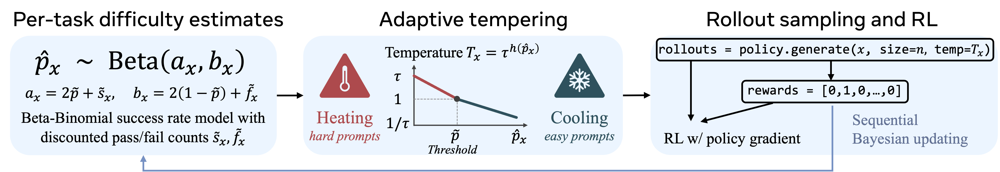

# Sharpening Tax：单次成功率提高后，解题范围可能缩小

作者：Oh, Changdae、Zeng, Qi、Qi, Qi、Zhmoginov, Andrey、Lei, Deren、He, Yun、Phan, Hoang、Kang, Hangoo、Mirhoseini, Azalia、Li, Sharon。arXiv:2610.01509 v1，提交2026-10-01。预印本。

新近创新 / 新近实用；热度待验证。已读核心原文，本站未训练复现。

后训练会把概率集中到更常成功的答案，但也可能压掉少见、仍然有效的解题路线。论文比较 4 个模型系列的 14 组基础与后训练模型，在 3 个代理基准上形成 42 个设置，发现 pass@1 的改善常与较大的 pass@K 覆盖损失同时出现。基础模型使用了轻量代理适配，因此比较的是论文设置下的系统表现。

作者用 pass@K 曲线构造归一化搜索潜力 S，并把基础模型与后训练模型的 S 差定义为 Sharpening Tax。42 个设置中有 36 个在 K=128 时税值为正。这个指标描述现象；不同检查点的训练差异不全相同，不能把每个差异都归因于单一 RL 步骤。

缓解方法 PTGS 在训练时用带遗忘的 Beta 分布估计题目难度，再按难度调整采样温度，给困难题保留探索空间。Qwen2.5-7B-Instruct 在 Sokoban 的 PPO 实验中，pass@1 从 46.5% 到 61.1%，pass@128 从 55.0% 到 69.7%，但后者仍低于基础模型的 76.6%。实验为 200 步、5 个随机种子；PPO 使用最终检查点，GRPO 使用验证集最优检查点，跨算法比较时要保留这项区别。

为什么现在值得看：评估编码或研究代理时，只看“一次就做对多少”会漏掉搜索预算增大后的能力。它也提醒训练者同时画出整条曲线。今天的[技术实践](../../../frontiers/2026/10/2026-10-03/05-技术实践.md)会实际运行一个合成概率例子来解释这个现象；该例子不是对 PTGS 或模型训练的复现。

Changdae Oh 等，论文 Figure 8 PTGS 原图：左侧用成功与失败记录估计题目难度分布，中间将难度映射为采样温度，右侧执行采样与强化学习后更新统计。图解释训练策略，不是本站跑出的结果。整图引用，CC BY 4.0。（[作者原图](https://arxiv.org/abs/2610.01509v1)；[查看大图](../../../frontiers/2026/10/2026-10-03/images/paper-ptgs.png)。）

[原始论文](https://arxiv.org/abs/2610.01509v1) · [版本许可](http://creativecommons.org/licenses/by/4.0/)

原文为CC BY 4.0，保存未改动的v1 PDF并保留作者和许可。
[归档PDF](2610.01509v1.pdf)

[返回本期论文精选](../../../frontiers/2026/10/2026-10-03/03-论文精选.md)
