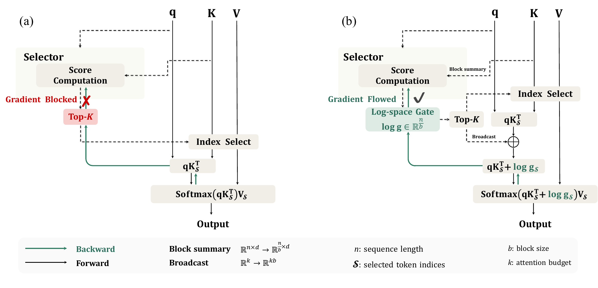

# SAS：让稀疏注意力的选择器也收到训练信号

作者：Li, Zhiwei、Zhu, Lei、Gu, Hao、Hu, Xiang、Wang, Yan、Mi, Haitao、Han, Sirui、Liang, Leo、Guo, Zhijiang。arXiv:2609.13141 v1，2026-09-11；本次按预印本阅读，未核实录用状态。

[原始论文](https://arxiv.org/abs/2609.13141v1) · [版本许可](http://arxiv.org/licenses/nonexclusive-distrib/1.0/)

稀疏注意力要先选少数 token 块，再做注意力计算。问题是硬 Top-K 的索引选择会截断梯度，选择器很难仅凭语言模型损失学会挑选。SAS 在被选块的注意力分数中加入归一化门控的对数，让损失能够沿门控分支更新选择器；离散索引本身仍然存在，不能称为整个选择过程都完全可微。

实验冻结 Qwen3 4B、8B、14B 主模型，训练额外选择器，并控制长上下文与块大小等配置。以 Qwen3-8B、1024 注意力预算的 GPQA 结果为例，分数由对照的 39.43 提升到 53.17，但完整注意力仍为 60.54。它说明紧预算时选择更有用的内容能减少损失，不等于稀疏版在所有场景已经追平完整模型。

系统实现还区分预填充与解码：论文后端在预填充使用完整注意力，在解码阶段做块稀疏处理，因此不能把注意力预算减少直接换算成同等比例的全部推理提速或 KV 内存下降。适合复核的第一步是门控位置与梯度路径，再比较相同预算的任务分数、端到端时间和内存。[作者实现](https://github.com/Tencent-Hunyuan/Simple-Attention-Sparsification)

左图的硬选择阻断梯度；右图把门控分支接入 Softmax 前的分数。沿红色／绿色路径读，理解多出的训练信号。（[作者原图](https://arxiv.org/abs/2609.13141v1)；[查看大图](../../../frontiers/2026/09/2026-09-15/images/paper-sas.png)。）

本版本为 arXiv 非独占分发许可，不等于允许本站重新分发全文，因此只归档阅读卡；上图限本条方法评论引用。

[返回 2026-09-15 论文精选](../../../frontiers/2026/09/2026-09-15/03-论文精选.md)
