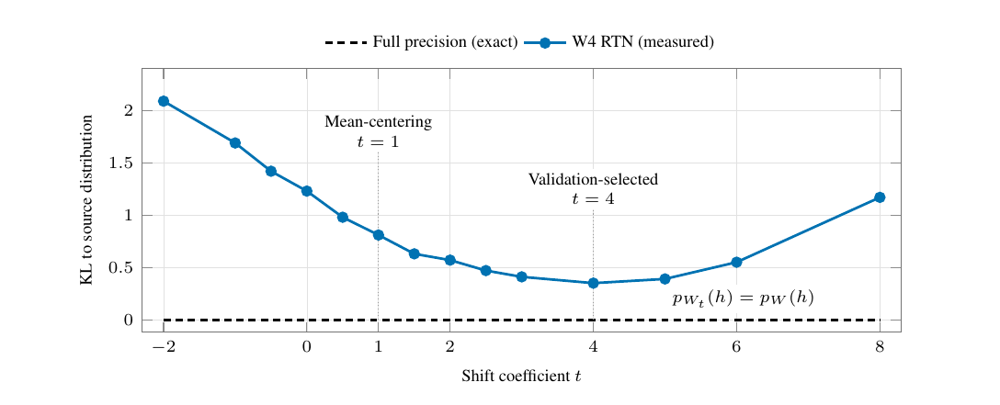

# Softmax Reparameterization：概率完全相同的权重，量化后不再等价

作者：Kadav, Asim、Flores, Christian、Arora, Chirag、Kotte, Varun、Zheng, Hongbo、Yan, Lan、Shanmugasundaram, Priya、King, Tracy Holloway。arXiv:2609.31291 v1，提交2026-09-25。预印本。

新近创新 / 新近实用；热度待验证。已读核心原文，本站未训练复现。

Softmax只看logit之间的相对差异。对输出权重的每一行减去同一个向量，再乘同一隐藏状态，所有logit就减去同一个标量；在精确计算中，概率完全不变。论文沿行均值方向引入参数t，改变权重的共同偏移，再对修改后的权重量化。

量化有舍入和裁切，原先等价的表示会出现不同误差。作者在14个候选t中用独立验证集挑选，再评估留出数据；这不是保证t=1或去均值总最好。量化拟合用128篇WikiText文章的隐藏状态，验证与测试各16篇，并另讨论独立保留数据来减少探索偏差。

七个输出头、W4/G128且解码器为BF16的条件下，Phi-4-mini的AWMSE KL从0.936到0.256，GPTQ从0.158到0.059；本来表现较好的Gemma和Qwen改善较小。低比特压力测试有更大相对变化，但绝对质量仍可能很差，不能只写下降百分比。

为什么现在值得看：它在不改变全精度函数的方向上寻找更容易压缩的表示。部署仍有边界：若logit先经过softcap等非线性，需要在非线性前恢复相应低秩项；输入输出嵌入绑定时，保留原输入嵌入与新输出头还会增加存储。本站的技术实践只用合成小矩阵验证代数与量化现象，不复现这些大模型成绩。

作者Figure 2的局部原图，CC BY 4.0，裁去页面正文但保留坐标、图例与曲线。同一个Phi模型中不同t产生不同量化KL，最小点不是普遍固定常数；完整页面可在归档PDF查看。（[作者原图](https://arxiv.org/abs/2609.31291v1)；[查看大图](../../../frontiers/2026/09/2026-09-29/images/softmax-shift.png)。）

[原始论文](https://arxiv.org/abs/2609.31291v1) · [版本许可](http://creativecommons.org/licenses/by/4.0/)

原文为CC BY 4.0，保存未改动的v1 PDF并保留作者和许可。
[归档PDF](2609.31291v1.pdf)

[返回本期论文精选](../../../frontiers/2026/09/2026-09-29/03-论文精选.md)
