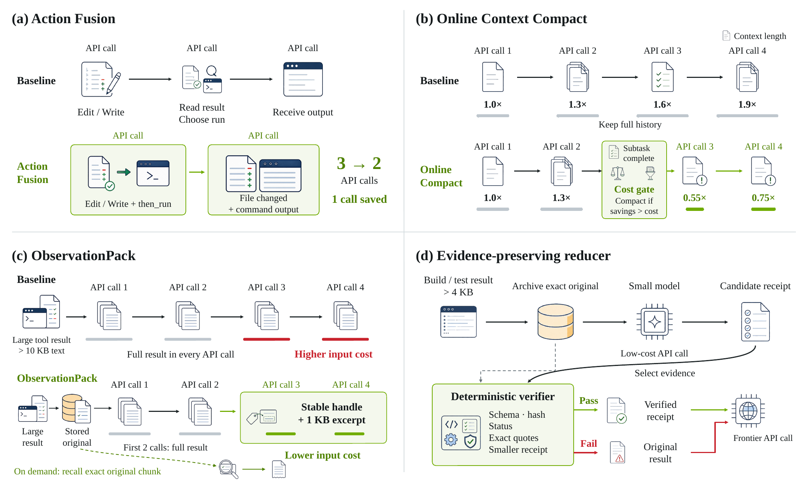

# SoL-Pi：让 Agent 改进自己的运行框架，验收条件先固定

作者：Liu, Haozhe、Ye, Tian、Gao, Sensen、Cao, Qihang、Li, Yitong、Zhuge, Mingchen、Wang, Duomin、Zhang, Ruihua、Luo, Ping、Bian, Jiawang、Zhu, Lei、Zhu, Ligeng、Xie, Enze、Han, Song。arXiv:2609.20519 v1，2026-09-17；按预印本阅读，不宣称录用。

[原始论文](https://arxiv.org/abs/2609.20519v1) · [版本许可](http://arxiv.org/licenses/nonexclusive-distrib/1.0/)

入选：新近创新，热度待验证。已读原文核心方法与结果；本站未复现训练或大型评测。

SoL-Pi搜索的是Agent外围框架：哪些动作能合并、什么时候压缩上下文、长输出怎样保留可取回证据，以及如何提炼测试日志。作者把能力容差与费用条件放在优化器之外，候选改动先经过独立的验收，再到最终留出任务比较，避免优化器自行放宽目标。

四类机制各有边界。ActionFusion只合并不需要中间观察的动作；上下文压缩按预算和时机触发；ObservationPack为长输出保存完整内容及稳定句柄；EvidenceReducer处理构建、测试等日志，并用结构、哈希、引用和退出码核验，失败退回原内容。后者不直接过滤所有文件读取，避免把关键代码误当冗长日志丢掉。

在论文的效率配置下，相对Pi，Sol后端token下降49.0%、API费用下降33.2%，但平均分从44.833降至42.003；Opus后端也有费用下降与分数损失。不能把“保留大部分能力”改写成“完全无损省一半”，更不能将另一个性能配置的高分嫁接过来。

搜索覆盖152个假设及535个环境，其中有合成环境；最终比较仍受任务集、价格日期与后端模型限制，搜索自身的费用也不等于部署后单次成本。适合已有可验收Agent任务的团队研究，不证明无限递归自我改进。作者提供[SoL-Pi代码入口](https://github.com/NVlabs/SoL-Pi)，本站未运行；最可复用的是冻结验收、保留原证据和失败回退。

作者四机制原图：分别对应动作合并、上下文压缩、长输出封装和日志提炼。优先读每个机制保留什么证据、何时回退；图示并不表示四项在所有后端都同时提高质量。（[作者原图](https://arxiv.org/abs/2609.20519v1)；[查看大图](../../../frontiers/2026/09/2026-09-19/images/solpi-mechanisms.png)。）

原版本仅授予arXiv非独占分发权，本站不再分发全文PDF；原图限本条研究评论所需引用，保留作者与来源。

[返回本期论文精选](../../../frontiers/2026/09/2026-09-19/03-论文精选.md)
