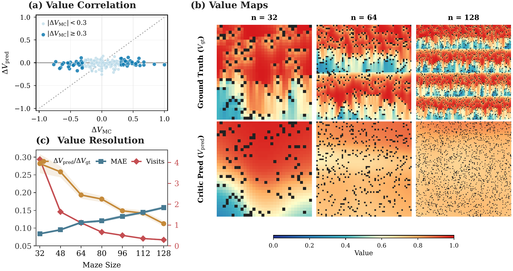

# SP3O：为什么每个token都训练价值网络，反而可能抹平差异

作者：Li, Yizhuo、Yan, Jianhao、Luo, Yun、Wang, Zhi、Wang, Futing、Tan, Rong-Xi、Tian, Kanghui、Cui, Ganqu、Ding, Ning、Zhao, Peilin、Li, Yafu、Cheng, Yu。arXiv:2609.18708 v1，2026-09-16；本期按预印本阅读，不宣称已录用。

[原始论文](https://arxiv.org/abs/2609.18708v1) · [版本许可](http://creativecommons.org/licenses/by/4.0/)

入选：新近创新。已读原文方法与实验；本站未复现。

在只给最终成败奖励的推理训练中，一条回答的所有位置常被赋予同一目标值。论文指出：当折扣与GAE参数均为1、没有中间KL奖励时，密集平方损失可拆成“平均预测接近最终回报”与“同一回答内预测差异变小”两部分。后一项会把价值曲线压平，削弱不同推理位置之间的差别。

相邻状态又共享大部分文本，其更新方向高度相关。SP3O只在相隔较远的状态施加critic损失，典型位置为回答进度30%、60%、90%；长度达到6144时再加95%。critic仍对全部位置产生预测，actor目标与采样流程保持一致，不是只生成或评分三个token。

作者在Qwen3-4B/8B-Base、DAPO-Math-17k上实验，最大回答长度8192、KL系数0。七项数学任务的平均成绩，4B为45.57，对照PPO37.60、GRPO39.26；8B为50.51，对照48.50、47.91。这里采用多次采样后的avg@32口径，不是32次机会有一次成功就算通过的pass@32。

原图通过受控FrozenLake实验显示同样问题：较大的状态空间里，真实价值仍有明显区域差异，critic图却趋于平坦。左侧散点也显示实际价值发生变化时，预测变化仍可能接近零。它支持问题诊断，不直接证明所有语言模型训练都会这样。

附录用固定状态多次续写估计价值，另比较稀疏位置、数量及过程误差。数学与部分分布外任务的作者实验值得复核，但模型规模、终局奖励和超参数范围有限。复现应先匹配奖励与返回目标，再比较梯度、价值分辨率和最终任务成绩，不能把“监督越少越好”当普遍规律。

作者问题诊断原图：右侧上排为FrozenLake真实价值，下排为critic估计；n表示迷宫规模。对照左上角预测变化接近零的散点，可以直观看到价值被抹平。（[作者原图](https://arxiv.org/abs/2609.18708v1)；[查看大图](../../../frontiers/2026/09/2026-09-18/images/paper-sp3o.png)。）

原始 PDF 按版本所列 http://creativecommons.org/licenses/by/4.0/ 保存，未改动内容。

[打开本站归档 PDF](2609.18708v1.pdf)

[返回本期论文精选](../../../frontiers/2026/09/2026-09-18/03-论文精选.md)
