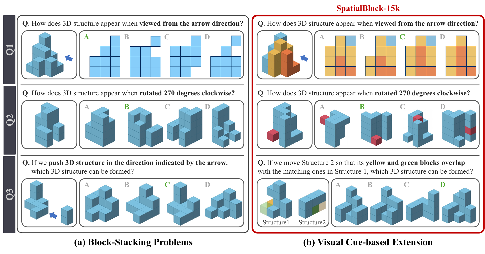

# SpatialBlock: Enhancing Spatial Intelligence in LVLMs via Synthetic Block-Stacking Problem

**2026-09-07 · arXiv 2609.07064v1 · 预印本。** 作者：Ryu, Soohyun; Kim, Sohee; Yang, Eunho。

合成问题能否补足视觉语言模型的空间理解。

看出图片里有积木，与判断旋转后哪块仍被遮挡，是两种能力。SpatialBlock 构造投影、视角旋转和结构组合三类问题，生成约 1.5 万条训练样本。颜色在这里用来标记部件身份，帮助模型建立跨视角对应，不能简单当作装饰删除。

作者比较直接答案监督训练与带推理的强化学习，并在多种 2B–7B 视觉语言模型上测试。核心对照是：合成积木题的进步能否迁移到不同来源的空间任务，而非只记住积木题模板。自建测试集有 600 题，另测 MindCube、MMSI、SPBench 和 MMMU 的相关选择题。

Qwen2.5-VL-3B 的自建题成绩从 29.9 提高到直接训练后的 94.8，但四项外部分布任务的整体成绩只从 37.7 到 41.0；推理训练对应约 41.2。两个变化幅度放在一起，才看得见方法的边界：学会了合成任务，并不等于通用三维理解已经解决。

值得复现的是去掉颜色标记、改变相机视角、换未见过的组合方式后，迁移收益还剩多少。论文评测主要是图像选择题，不能直接推出机器人抓取或真实场景导航成功率。

Soohyun Ryu 等的任务原图。先看每行左侧输入，再追踪相同颜色在右侧候选中的位置；绿色答案标记用于展示题型。它解释训练信号来自哪里，不是本站新做的测验。（[论文原图](https://arxiv.org/abs/2609.07064v1)；[查看大图](../../../frontiers/2026/09/2026-09-14/images/paper-spatialblock.png)。）

来源：[arXiv 版本页面](https://arxiv.org/abs/2609.07064v1)。

## 版本与归档

原文采用 [CC BY 4.0](https://creativecommons.org/licenses/by/4.0/)，本站于 2026-09-14 保存未修改的 v1 PDF：[站内原文](2609.07064v1.pdf)。

本卡依据 v1 的方法、实验及限制整理，阅读日期为 2026-09-14，未复现训练或评测。原图仅栅格化为 PNG，未改写数据和关系。
