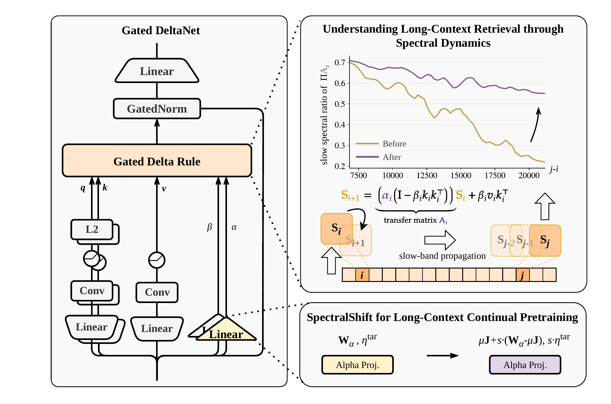

# SpectralShift：长上下文既要记得住，也要忘得掉

作者：Liu, Zian、Hu, Yiwen、Dong, Zican、Xie, Tian、Zhao, Wayne Xin、Ding, Yucheng、Tao, Ran、Dai, Bryan。arXiv:2609.14320 v1，2026-09-13；本期按预印本阅读，不宣称已录用。

[原始论文](https://arxiv.org/abs/2609.14320v1) · [版本许可](http://creativecommons.org/licenses/by/4.0/)

入选：新近创新。已读原文方法与实验；本站未复现。

线性注意力把历史压进有限状态，节省了随序列增长的缓存，却可能过早遗忘。SpectralShift从Gated DeltaNet状态传递的谱动态分析：慢衰减方向帮助保留远处信息，快衰减方向帮助写入新内容、处理上下文切换。把全部记忆都一味延长，也可能带来另一种干扰。

方法调整alpha投影围绕均值的偏差，并同步调整相关学习率，缩放因子由参考长度与目标长度之比的平方根决定，然后继续预训练。图下方的变换作用于参数和训练动态；它不是推理时打开一个开关，就能免费得到更长上下文。

实验使用作者自建1.5B、激活0.6B的GDN MoE，先在8K窗口预训练500B token，再以32K、64K或128K继续训练。两阶段128K设置的RULER平均分为55.18，对照52.38，差值2.8个百分点，约5.35%相对提高；两种百分比不能互换。通用能力总体接近，也不意味着每项任务都提升。

原图右上角展示慢谱方向随距离传播的变化，为为什么要调整遗忘速度提供直觉。理论分析有模型和局部动力学假设，实验目前仅在较小规模模型验证。作者明确未在更大型开放Hybrid模型上完整重复，因此适合用于研究长上下文机制，而非承诺直接改善任意Qwen或其他混合架构。

作者方法原图：右上角看慢衰减方向怎样随token距离保留，右下角看alpha投影及学习率的调整。曲线不是下游准确率；延长上下文仍包含继续预训练。（[作者原图](https://arxiv.org/abs/2609.14320v1)；[查看大图](../../../frontiers/2026/09/2026-09-18/images/paper-spectral.png)。）

原始 PDF 按版本所列 http://creativecommons.org/licenses/by/4.0/ 保存，未改动内容。

[打开本站归档 PDF](2609.14320v1.pdf)

[返回本期论文精选](../../../frontiers/2026/09/2026-09-18/03-论文精选.md)
