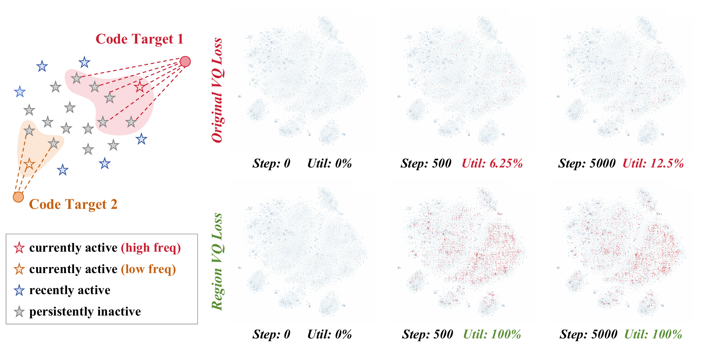

# StableVQ：让编码器和码本各自学好自己的事

作者：Tang, Bao、Guo, Jiahao、Cao, Haoxiang、Liu, Wenyu、Yu, Changqian、Gai, Kun、Wang, Xinggang。arXiv:2609.26774 v1，2026-09-22。预印本。

新近创新 / 新近实用；热度待验证。已读核心原文，本站未复现。

向量量化会把连续图像特征映射到有限的“码字”。常见问题是少数码字一直被选，其他码字收不到有效梯度；编码器输出的范围一变，码本还可能跟不上。StableVQ 不靠再加一个复杂投影器，而是拆开两边的学习职责。

Dynamic STE 降低离匹配码字较远的 token 所传递的近似重建梯度；Region VQ 将活跃码字收到的目标分配给附近长期未用的码字；编码器采用预热与退火，码本则用独立的较高常数学习率。图中的蓝色特征和红色码字能直观看到为何“有梯度”仍不等于分布对齐。

在 ImageNet 256×256、每图 256 token 的重建任务上，16,384×256 码本、40 epoch 的 StableVQ 报告 rFID 1.22，作者重现的 SimVQ 与 FVQ 为 2.89、1.70；三者标准设置都能达到 100% 码本使用率。这说明使用率不是重建质量的替代指标。更长训练到 120 epoch 的数字不能与 40 epoch 混为同预算比较。

消融中单独启用某一组件仍会失败，三者配合更完整。研究还用了特定判别器和训练设置，不应把全部收益都归到一个损失项。现在值得看的是可定位、可干预的失稳机制；跨视频、音频及大规模生成任务是否同样有效仍待验证。

作者 Region VQ 图（Figure 3）。左侧将活跃码字的目标传给邻近闲置码字，右侧是冻结编码器的先导实验：蓝色是特征、红色是码字。此受控实验不等于完整生成任务。（[作者原图](https://arxiv.org/abs/2609.26774v1)；[查看大图](../../../frontiers/2026/09/2026-09-24/images/stablevq-region.png)。）

[原始论文](https://arxiv.org/abs/2609.26774v1) · [版本许可](http://arxiv.org/licenses/nonexclusive-distrib/1.0/)

版本采用 arXiv 非独占分发许可，本站不据此再分发全文，只保留阅读卡和原站链接；方法图仅限本条技术评论引用，未改动关系或数据。
[返回本期论文精选](../../../frontiers/2026/09/2026-09-24/03-论文精选.md)
