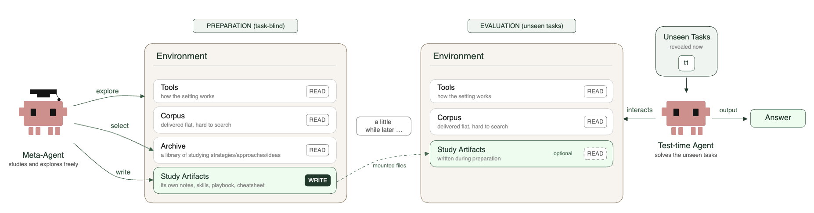

# Studying without a Syllabus：任务到来前，先整理环境

作者：Samuel, Vinay、Ursekar, Varun、Kalmath, Vijay S.、Shanker, Apaar、Chatrath, Veronica、Xue, Yuan。arXiv:2609.10824 v1，2026-09-09；本次按预印本阅读，未核实录用状态。

[原始论文](https://arxiv.org/abs/2609.10824v1) · [版本许可](http://creativecommons.org/licenses/by/4.0/)

人可以先熟悉工作环境，再处理未来的问题。论文把类似过程交给 Agent：在具体测试任务尚未知时探索代码、文件和工具，生成索引、指南等资料；真正的任务到来后，求解器读取这些资料。基础模型权重与执行框架保持固定，提升来自准备阶段留下的内容，不是再次微调模型。

实验覆盖六个基准、三十六个环境，并比较无准备、已有准备方法和不同归档策略。带归档的方案相对无准备在六项均有改善，但并非每项都最好：BCP-G 中 CORPUS2SKILL 为 0.471，论文带归档方案为 0.286，无准备为 0.197。保留这个反例，才能看到方法仍依赖任务与环境结构。

结果还区分 Avg@3 与从三次结果中挑最好的 Best@3，后者不能当成一次运行的可靠成功率。准备预算增加也不保证持续改善。适合重复使用同一环境的场景：把准备成本分摊到多个未来任务；若每次只做一道新题，前置探索未必划算。复核时尤其要检查准备阶段是否真的看不到未来任务、标签或奖励。

左半部分只能看环境与历史资料，并写入绿色归档；右半部分才出现具体任务。这个信息隔离是实验成立的关键。（[作者原图](https://arxiv.org/abs/2609.10824v1)；[查看大图](../../../frontiers/2026/09/2026-09-15/images/paper-study.png)。）

[打开本站归档 PDF](2609.10824v1.pdf)

[返回 2026-09-15 论文精选](../../../frontiers/2026/09/2026-09-15/03-论文精选.md)
