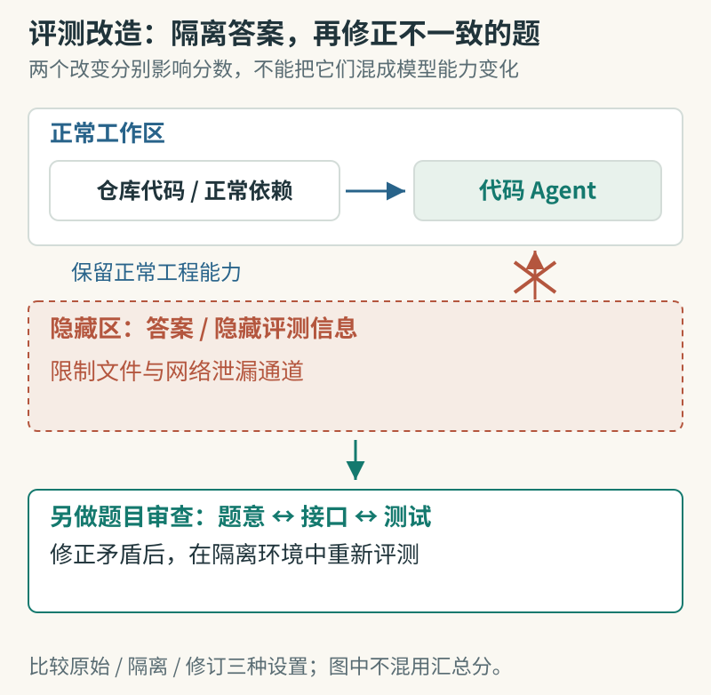

# SWE-Bench Pro Verified：先检查评测环境有没有泄题

[arXiv:2609.08149v1](https://arxiv.org/abs/2609.08149v1)，2026-09-08 提交，v1 预印本。阅读记录日期：2026-09-11。

原题：SWE-Bench Pro Verified: A Reliable Benchmark for Software Engineering Agents。

作者：Pujun Zheng、Zixin Shang、Shufan Jiang、Wenhui Tian、Dongsheng Zhu、Zerun Ma、Dingbo Yuan、Qi Zhang。

## 研究问题与摘要

当代码 Agent 得到正确补丁时，原因可能是解决了问题，也可能是在环境中找到了答案。SWE-Bench Pro Verified 同时处理两类问题：阻断答案与隐藏评测信息泄漏，以及修正题意、接口要求和测试之间的不一致。它尽量保留正常依赖与代码检查能力。

研究比较原始、隔离泄漏、修订题目三个设置，分析七种模型的表现，并对部分运行轨迹做配对审计。结果显示，一些模型在加强隔离后分数明显下降，而修好坏题又能恢复部分有效通过。比“新榜单谁第一”更值得研究的是：分数变化分别来自哪些环境条件。

作者承认，网络阻断和文件清理不能穷尽所有泄漏通道，人工审题也可能漏掉错误。原文部分汇总分与配对计数的口径需进一步核对，本期不把它们合成一个准确率结论。

图：红色叉表示限制泄漏通道，正常工作区仍可用于开发；下半部分是另一项题目修订。本站依据[论文方法与审计设置](https://arxiv.org/html/2609.08149v1)绘制。因原文汇总与配对计数口径存在待核问题，本图不合成准确率柱状图。

## 原文怎么读

建议先读第 3.1 节的问题分类，再看第 3.2—3.3 节如何保护环境、修订题目，最后读第 4 节的轨迹分析。论文不是简单把测试变严，而是同时移除不该看见的信息、修复本来无法正确完成的任务。

数字阅读时要注意一处疑点：正文报告 GLM-5.2 在某配对比较中由 78.80% 降至 57.32%；但表 4 的 731 个实例计数为 404 个继续通过、186 个退步、15 个改善、126 个持续失败。直接用这些计数计算，不会得到上述两项比例。本文保留这一口径疑问，没有替作者补写解释。

工程复现应保存任务快照、允许访问的材料和每个实例的转移结果。环境修改后，先确认正常装依赖、运行程序的能力仍存在，再检查答案泄漏，才能避免把“把系统弄坏”误认为更严格的评测。项目与数据入口在原文页中可查；本期未运行完整基准。

## 原文与归档

[原始 PDF](https://arxiv.org/pdf/2609.08149v1) · [HTML](https://arxiv.org/html/2609.08149v1)。本页是原创阅读笔记；未核实本站全文再分发许可，因此归档原创阅读卡，保留 arXiv 原文及固定版本 PDF 入口。

[返回 9 月 11 日论文精选](../../../frontiers/2026/09/2026-09-11/03-论文精选.md)
