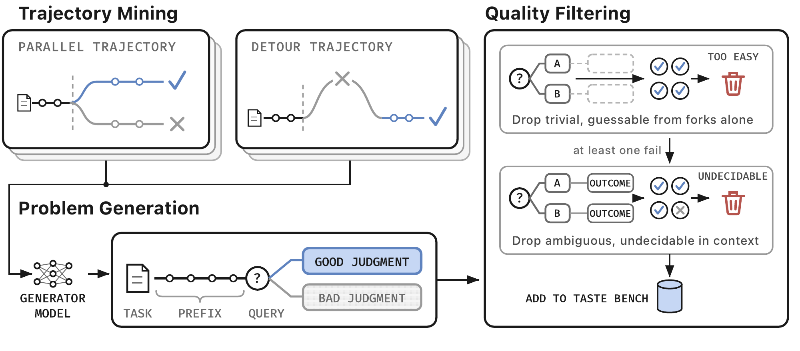

# Tasteful Agent：在结果出来前，选对下一条路

作者：Pan, Wenbo、Liu, Zhichao、Liu, Shujie、Zeng, Jingying、Lin, Chin-Yew、Tang, Xianfeng、Lu, Yan、He, Qi、Jia, Xiaohua。arXiv:2609.25804 v1，2026-09-22。预印本。

新近创新 / 新近实用；热度待验证。已读核心原文，本站未复现。

Agent 最终做对题，可能靠正确判断，也可能靠反复试错。TasteBench 把轨迹停在分叉点：给模型此前的任务和上下文，让它在两个可行方向中选择；答案来自之后真实发生的执行结果。平行尝试与一次运行中的“走错再纠正”提供两类题，过滤掉光看措辞就能猜中、或后续记录仍不能确定优劣的样本。

最终 502 题来自软件工程和机器学习研究轨迹。每题交换选项顺序测两次，两次都正确才记为正确；两个领域再等权平均。因而随机独立猜测的基线是 25%，不是普通二选一的 50%。14 个模型中最高为 GPT-5.6 Sol 的 59.7%。当区分好坏需要更多后续工作时，平均分明显下降；增加推理预算的检查仅覆盖两款模型，不能推成所有模型“多想无用”。

作者用知道正确方向的教师产生推理，再蒸馏给只能看分叉问题的 Qwen3.6-27B 学生。按原任务划分的交叉验证中，工程题两序都对的准确率从 30.0% 到 47.9%。在 41 个保留的 SWE-bench Pro 任务中，把学生对已挖掘分叉的建议预先注入上下文，执行成功率从 14.6% 到 33.7%。

这个端到端结果依赖预先找出的分叉和固定执行器，尚不是从零自主识别任意决策点的系统。事后轨迹也不能彻底排除执行随机性。现在值得借鉴的是：为关键选择保留“当时看见什么、选择了什么、后来怎样”的证据，再研究能否把判断迁移到新任务。

作者构造与过滤图（Figure 2）。左上两支分别取自平行尝试和绕路恢复，右侧过滤过于简单或无法确定优劣的题目；评测输入停在分叉前，后续结果只用于产生标签。原图有限引用，完整作者名单见阅读卡。（[作者原图](https://arxiv.org/abs/2609.25804v1)；[查看大图](../../../frontiers/2026/09/2026-09-24/images/tastebench-construction.png)。）

[原始论文](https://arxiv.org/abs/2609.25804v1) · [版本许可](http://arxiv.org/licenses/nonexclusive-distrib/1.0/)

版本采用 arXiv 非独占分发许可，本站不据此再分发全文，只保留阅读卡和原站链接；方法图仅限本条技术评论引用，未改动关系或数据。
[返回本期论文精选](../../../frontiers/2026/09/2026-09-24/03-论文精选.md)
