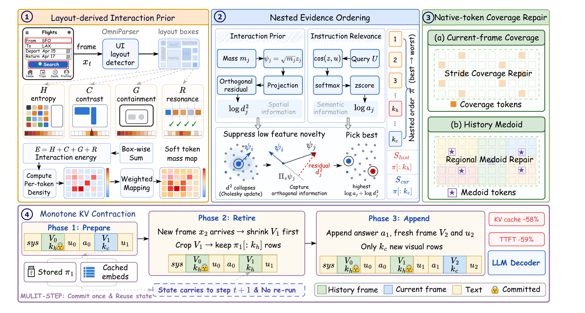

# TRACE：截图只编码一次，怎样为后续动作保留线索

作者：Wang, Yuhao、Qiao, Mu、Zhang, Xindong、Zhuge, Yunzhi、Zhang, Lei、Lu, Huchuan。arXiv:2609.10297 v1，2026-09-09；本次按预印本阅读，未核实录用状态。

[原始论文](https://arxiv.org/abs/2609.10297v1) · [版本许可](http://creativecommons.org/licenses/by/4.0/)

GUI Agent 连续看截图时，视觉 token 很快挤满上下文。普通剪枝只关心当前问题，可能把下一步需要的按钮或布局信息丢掉。TRACE 把问题改写为缓存准入：综合界面结构、当前指令、信息新颖性与空间覆盖，为 token 生成嵌套顺序；不同预算取顺序的前缀，历史预算收紧时无需重新编码整张图。

这是一种不增加训练的推理方法，论文在六个 GUI 基准及两个模型系列上评估。关键效率表使用 GUI-Owl-1.5-8B、OmniGUI 和 mild 预算：KV 从 697MB 降至 292MB，首 token 时间从 1102.6ms 降至 453.9ms；同时步骤成功率由完整基线 52.45 降至 48.91。所谓保留 93.3% 指相对原成功率的比例，不是绝对成功率达到 93.3%。

端到端耗时从 2958.2ms 降至 2295.8ms，改善幅度小于首 token 时间，因为选择与执行还有其他开销。方法适合研究多轮视觉缓存，不能把单表延迟直接套给所有设备或网页任务。论文称代码将发布，本次未把它记成已可完整运行的开源项目。

上方比较只顾当前截图与面向多轮缓存的保留策略；下方的节省数字需结合正文中模型、基准、预算及成功率下降一起看。（[作者原图](https://arxiv.org/abs/2609.10297v1)；[查看大图](../../../frontiers/2026/09/2026-09-15/images/paper-trace.png)。）

[打开本站归档 PDF](2609.10297v1.pdf)

[返回 2026-09-15 论文精选](../../../frontiers/2026/09/2026-09-15/03-论文精选.md)
