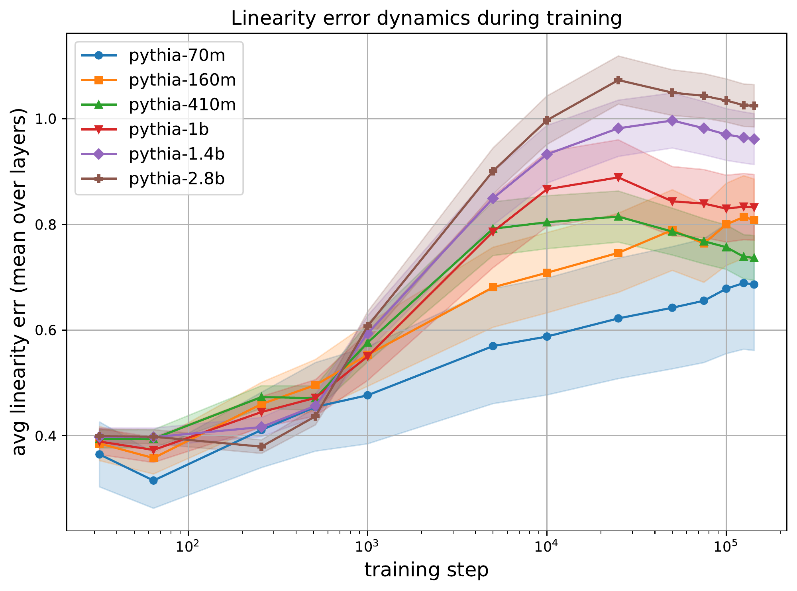

# 线性叠加：一个Transformer能同时容纳两路文本吗

作者：Tikhonov, Pavel、Korznikov, Anton、Mikhalchuk, Matvey、Dragunov, Nikita、Rahmatullaev, Temurbek、Druzhinina, Polina、Razzhigaev, Anton、Oseledets, Ivan、Tutubalina, Elena。arXiv:2609.29845 v1，首发2026-09-24。预印本。

新近创新 / 新近实用；热度待验证。已读核心原文，本站未复现。

把两句话的向量取平均，送进一次Transformer，输出会不会近似两次独立计算的平均？论文发现预训练模型存在一定线性叠加性质，但随着训练推进，这种近似会变化；“同时容纳两种想法”是对表示行为的描述，不等于两项任务都能无损、加倍速完成。

作者进一步冻结教师，用两次独立输出的平均分布训练接收混合嵌入的学生。Pythia设置下，分布差异KL从1.86降到0.27，同时单路LAMBADA准确率从0.544降到0.357。模型更擅长保持叠加关系，却牺牲原来的单路能力，这个代价不能省略。

为从混合输出里分离两路结果，Guided Joint Contrastive方法再调用较小模型，分别估计两路分布，用加减的对比项引导大模型输出。Llama 3.2 3B搭配1B的小模型时，混合输入准确率从0.182改善到0.430，但仍低于小模型独立运行的0.540。

速度也取决于对照是谁。在论文的128输入、128生成长度测量中，引导方法约52.4 token/s，比逐条运行的41.3快，却慢于batch=2的81.4。新近创新在于把叠加性质变成可训练、可分析的研究问题；部署前仍需对比正常批处理，计算辅助模型开销，不能宣传为通用“两倍吞吐”。

作者训练动态原图，比较不同规模Pythia在预训练过程中的线性近似程度。先看横轴训练进度，再比较各曲线；它展示表示性质如何变化，不是端到端吞吐测试。保留完整图，中文正文解释实际质量与成本。（[作者原图](https://arxiv.org/abs/2609.29845v1)；[查看大图](../../../frontiers/2026/09/2026-09-26/images/linear-training.png)。）

[原始论文](https://arxiv.org/abs/2609.29845v1) · [版本许可](http://creativecommons.org/licenses/by-nc-nd/4.0/)

采用CC BY-NC-ND 4.0；本期保留阅读卡和原站入口，方法图仅作有署名的技术评论引用。
[返回本期论文精选](../../../frontiers/2026/09/2026-09-26/03-论文精选.md)
