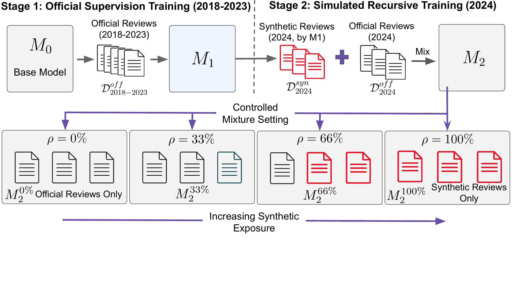

# TrustReviewer：合成审稿训练后，意见会不会越来越像

作者：Ho, Sy-Tuyen、Liu, Minghui、Huang, Furong。arXiv:2609.20942 v1，2026-09-17。预印本，未宣称录用。

入选：新近创新；热度待验证。已读核心原文，本站未复现。

论文从一个可控问题出发：下一代审稿模型继续学习上一代模型写的评审，会不会变得更同质？作者先在 2018–2023 年 ICLR 官方评审上训练 Llama-3.1-8B，再把 2024 年评审替换为 0%、约 33%、约 66% 或 100% 的模型评审，其他训练条件保持一致。这里的“官方”不等于经核实的纯人工文本。

在固定的 2000 篇留出论文上，合成比例增加后，同一论文多次评审之间的平均语义距离由约 0.159 降到 0.142，约缩小 11%。评分平均值却不是单调升高或降低，因此结果主要支持意见分布收窄，不能概括成模型一定越来越宽松。实验只做了一次递归训练，并非观察无穷多代后的必然结果。

缓解方案 TrustReviewer 包括整理官方评审语料和推理时激活引导。它对同一论文的官方评审与生成评审比较内部表示，估计差异方向，生成时在选定层加入较小偏移，不重新更新模型参数。

作者报告 exact match 从无引导的 73.85% 到 75.40%。该指标要求生成评分匹配该论文至少一位官方评审的评分，不是证明审稿判断正确，更不是匹配真实学术质量。评分平均绝对距离基本不变，部分多样性指标也未全部改善。值得研究的是监督来源如何影响判断分布，而不是让分数接近人类成为自动审稿的充分条件。

作者 Figure 1。先固定初始评审模型，再改变第二阶段明确由模型生成的评审比例；四组共享训练条件。图中的比例只指显式替换部分，未统计官方评审中未知的 AI 辅助。（[作者原图](https://arxiv.org/abs/2609.20942v1)；[查看大图](../../../frontiers/2026/09/2026-09-22/images/reviewer-method.png)。）

[原始论文](https://arxiv.org/abs/2609.20942v1) · [版本许可](http://arxiv.org/licenses/nonexclusive-distrib/1.0/)

此版本采用 arXiv 非独占分发许可，不能据此推断本站获准再分发全文；本站只保存阅读卡，PDF 请到原站阅读。方法图在本页针对性技术评论中作有限引用，未改动数据或关系，不表示可任意再分发。
[返回本期论文精选](../../../frontiers/2026/09/2026-09-22/03-论文精选.md)
