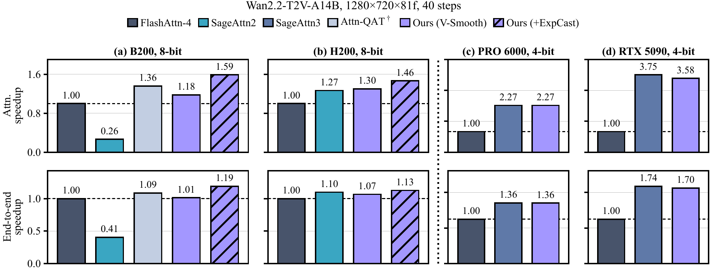
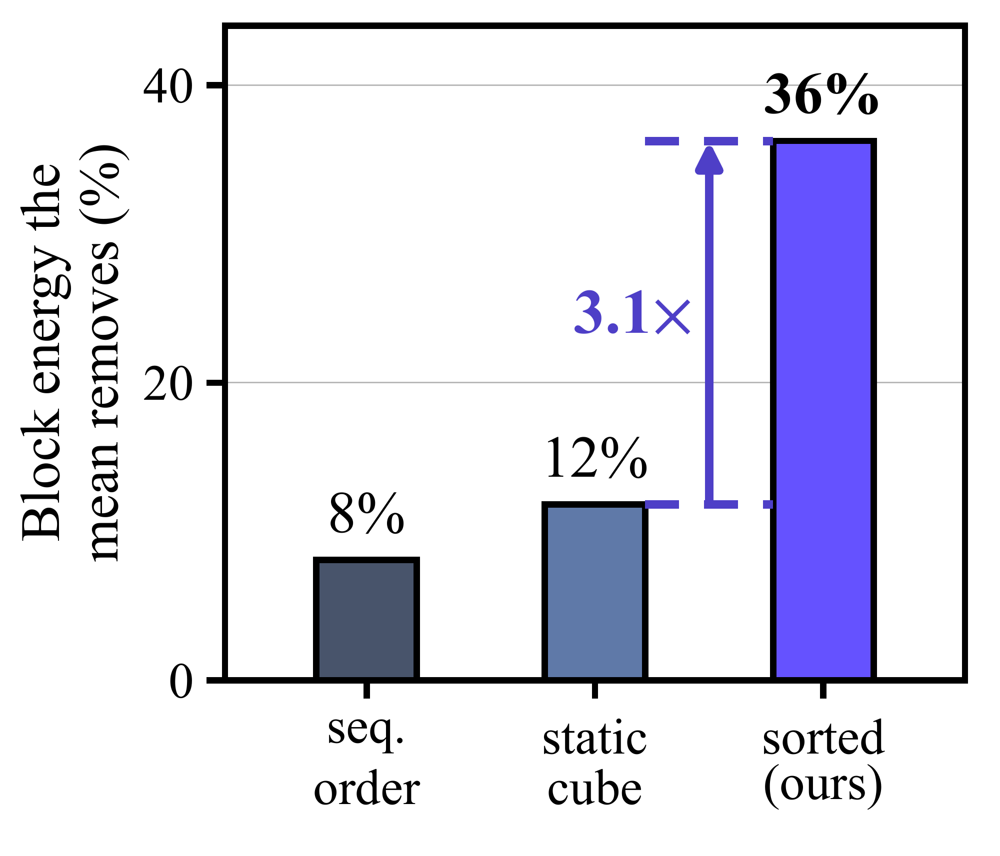

# VC Attention：把相似值分组，再做低精度计算

作者：Li, Xingyang、Zou, Dongyun、Zhang, Shining、Chen, Jiacheng、Xi, Haocheng、Zhang, Lvmin、Zhu, Jun-Yan、Han, Song、Zhang, Zhekai、Lin, Yujun、Li, Muyang。arXiv:2609.15810 v1，2026-09-14；本期按预印本阅读，不宣称已录用。

[原始论文](https://arxiv.org/abs/2609.15810v1) · [版本许可](http://creativecommons.org/licenses/by/4.0/)

入选：新近创新。已读原文方法与实验；本站未复现。

视频扩散模型的注意力需要处理大量时空token。VC Attention从数值表示入手：V-Smooth在线把相似的V向量分组，相应重排K，减去块均值后再量化残差，并在计算中恢复均值。先把相近内容放到一起，均值才能消除更多共同成分，给低比特表示留下更容易处理的残差。

另一项ExpCast直接从对数分数近似得到FP8表示，减少指数和类型转换的开销。它给出的误差界有格式、范围和下溢尾部等条件，不能将3.64%写成整个视频系统的总误差保证。分组本身也有成本，作者在去噪早期做聚类并复用排列。

作者在四种视频DiT、100条MovieGen提示上比较，保持种子与硬件一致。B200的8bit路径相对BF16 FlashAttention4，注意力约快1.59倍，端到端约1.19倍；H200对应1.46与1.13。RTX5090使用4bit V-Smooth路径，分别约3.58与1.70倍，不能把不同设备、精度与算子配置拼成一个通用数字。

均值消除图解释分组为何有帮助：按内容重新排列后，同块共享成分更多，去均值移除的能量比例提高；它不是画质提升百分比。下方速度图则明确区分内核和端到端。与Attn-QAT的对照采用免训练设置，不是该方法充分重训练后的最佳结果。

输出比较主要衡量与BF16参考的接近程度，不代表真实视觉质量完整提高；加入ExpCast相对仅V-Smooth还会牺牲部分PSNR。适合研究低精度注意力的性能与误差取舍，部署前要对目标模型、提示分布和硬件分别复核。

作者速度原图：上排是注意力，下排是端到端；左两列8bit含ExpCast，右两列4bit仅V-Smooth。各列以同机BF16 FlashAttention4作基线，不能跨列拼接倍数。（[来源原图](https://arxiv.org/abs/2609.15810v1)；[查看大图](../../../frontiers/2026/09/2026-09-18/images/paper-vc-speed.png)。）

作者分组分析原图：纵轴为去块均值移除的能量比例，比较顺序分块、静态时空块与按内容排序。比例提高解释共同成分更集中，不是画质或速度提升比例。（[作者原图](https://arxiv.org/abs/2609.15810v1)；[查看大图](../../../frontiers/2026/09/2026-09-18/images/paper-vsmooth.png)。）

原始 PDF 按版本所列 http://creativecommons.org/licenses/by/4.0/ 保存，未改动内容。

[打开本站归档 PDF](2609.15810v1.pdf)

[返回本期论文精选](../../../frontiers/2026/09/2026-09-18/03-论文精选.md)
