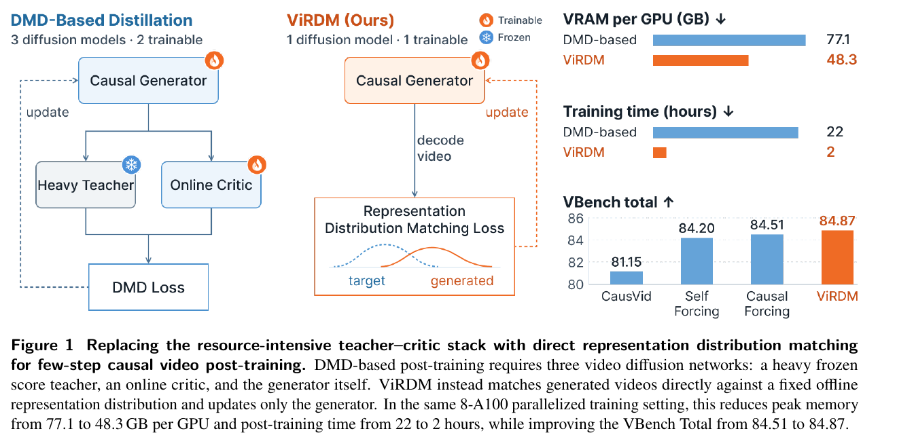

# ViRDM：视频后训练可以移除在线教师和评论器，但仍需要好的起点

作者：Meng, Zichong、Ge, Chongjian、Huang, Chun-Hao P.、Zhou, Yang、Jiang, Huaizu。arXiv:2609.28923 v1，arXiv提交2026-09-24。预印本。

新近创新 / 新近实用；热度待验证。已读核心原文，本站未复现。

ViRDM研究少步、分块生成视频的后训练。传统DMD同时维护生成器、大教师与在线评论器；它改为预先编码6505组视频与文字，训练时让生成视频的表征分布靠近这个固定参照。视频编码器和文本编码器仍存在，只是不再维持那两个扩散分数模型，不能理解为只剩一张网络且无其他计算。

把图像方法直接搬到视频会爆显存，也容易得到“画面像样但运动很少”的输出。作者随机选择一个去噪步骤做反向传播，使用轻量VAE解码器，并分阶段计算向量—雅可比积，让几段反向计算图不同时驻留。之后增加弱光流约束，修正视频表征对运动强度不敏感的问题。

在Wan2.1-1.3B、81帧、832×480、四步因果生成条件下，VBench总分84.87，对照Causal Forcing为84.51。相同8张A100的最终分布匹配阶段，显存峰值每卡77.1GB到48.3GB，墙钟22小时到2小时。这个16 GPU小时不包含共享初始化，也不包含从头预训练；少更新20步不代表从零训练视频模型只要两小时。

因果初始化是必要条件：短后训练不能可靠把任意双向模型直接变成因果生成器。主实验还未覆盖更大模型、更高分辨率和很长视频，固定表征与参照集会带来偏向。arXiv提交为9月24日，稿内日期写9月4日，本期保留两者，按近30天近期补充处理，不推定24日就是研究首次公开。为什么现在值得看：它把资源瓶颈、运动不足与初始化分别做了对照，提供可诊断的后训练路线。

Zichong Meng等人的图1，忠实裁取PDF第1页的完整图与图注；[完整原页](https://arxiv.org/pdf/2609.28923v1#page=1)。左侧三扩散网络换成中间固定分布匹配，右侧资源只计最终后训练阶段。保留数据与坐标，单图限本条技术评论引用。（[作者原图](https://arxiv.org/abs/2609.28923v1)；[查看大图](../../../frontiers/2026/09/2026-09-28/images/virdm-method.png)。）

[原始论文](https://arxiv.org/abs/2609.28923v1) · [版本许可](http://arxiv.org/licenses/nonexclusive-distrib/1.0/)

arXiv非独占分发许可不直接授权本站再分发全文，因此仅归档阅读卡与原站链接；单幅原图限本条方法或实验评论引用。
[返回本期论文精选](../../../frontiers/2026/09/2026-09-28/03-论文精选.md)
