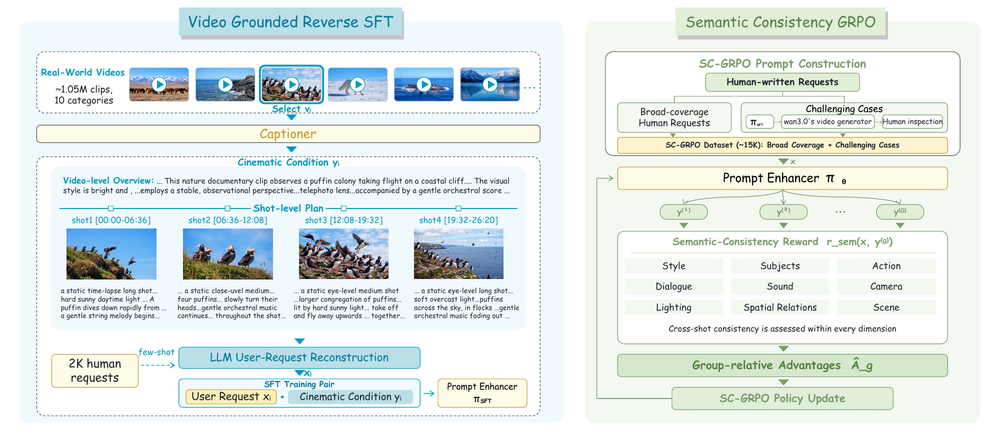

# WanPE：先把拍摄意图写清，再让视频模型生成

作者：Zhu, Yubo、Shao, Yawen、Dai, Ziyun、Fang, Zixun、Zhu, Kai、Sun, Siyang、Xue, Haolan、Wang, Chuxin、Weng, Tingyu、Luo, Jingming、Shi, Chen、Huang, Lianghua、Ai, Yufeng、Wang, Yuzheng、Zhang, Wenyuan、Shang, Yu、Bao, Yuxiang、Bi, Zoubin、Xiao, Jie、Xing, Jinbo、Zhao, Jiaxing、Zhong, Chongyang、Chen, Hengjian、Xie, Chenwei、Liu, Akide、Kan, Zhehan、Liu, Yu、Zhai, Wei、Zhong, Sheng、Tong, Wei。arXiv:2609.30221 v1，首发2026-09-24。预印本。

新近创新 / 新近实用；热度待验证。已读核心原文，本站未复现。

用户写“一个人在雨中跑”，视频模型需要自己补镜头、动作衔接和场景细节。WanPE负责把这种短请求变成更明确的视频描述；它是提示词增强器，不是新的像素生成器。用户真正想保留的主体、关系和否定条件，需要在扩写过程中保持。

训练先从105万段真实视频获得详细描述，再用GPT-5.4反向构造较短的用户请求，形成“短请求→详细提示”的监督对。之后用约1.5万条数据进行SC-GRPO，借助Qwen3.7-Max评价九类语义要求，让流畅扩写受到原意约束。作者考察4B、9B、35B到397B模型，最终效果与这些训练和计算条件相关。

WanPEval有249个请求，覆盖5至30秒视频；60名评审提供一万余组盲评。固定Wan 3生成器时，5至15秒组的汇总分从33.80升至50.61，30秒组从9.38升至60.24。该分数按胜出与“两者都好”等判断汇总，不是“60%的用户需求已解决”，不同长度组也不是同一题集。

现在值得看的方法是把“丰富细节”和“忠实原意”分开训练、一起检查。较长视频的收益可能包含提示长度和生成器适配效应；评判模型、合成请求与商业视频后端也限制了可复现性。论文有同设置消融，但不能由此推断对所有视频模型、中文提示或真实生产任务都同样有效。

作者训练流程原图。从真实视频到详细描述、再构造短请求，形成监督训练数据；后续强化学习检查扩写是否保留原意。图中的视频生成与评估路径和提示增强器是不同组件，不能混成一个新视频模型。（[作者原图](https://arxiv.org/abs/2609.30221v1)；[查看大图](../../../frontiers/2026/09/2026-09-26/images/wanpe-pipeline.png)。）

[原始论文](https://arxiv.org/abs/2609.30221v1) · [版本许可](http://arxiv.org/licenses/nonexclusive-distrib/1.0/)

arXiv非独占分发许可不直接授权本站再分发全文，因此仅归档阅读卡与原站链接；单幅原图限本条方法或实验评论引用。
[返回本期论文精选](../../../frontiers/2026/09/2026-09-26/03-论文精选.md)
