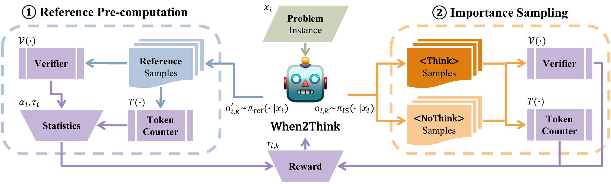

# When2Think：先答对，再奖励少用推理 token

作者：Shim, Jaejun、Kim, HyunJin、Kim, Young Jin、Bak, JinYeong。arXiv:2609.19671 v1，2026-09-17；按预印本阅读，不宣称录用。

[原始论文](https://arxiv.org/abs/2609.19671v1) · [版本许可](http://creativecommons.org/licenses/by/4.0/)

入选：新近创新，热度待验证。已读原文核心方法与结果；本站未复现训练或大型评测。

让模型少思考容易产生副作用：简单题节约了token，难题也被迫过早停止。When2Think同时学习是否显式思考与思考多长。它先用参考模型对每道训练题采样，估计正确率与平均推理长度，再用这些题目级统计调节效率奖励。

奖励的关键是正确性门控。答错时拿不到效率奖金；答对时，Think轨迹的奖励系数随长度增加而衰减，参考模型越难答对的题，衰减越缓。NoThink的系数设为1。训练还在首次模式token上平衡Think与NoThink探索，并在批内标准化优势，避免训练一开始就被某一种模式占满。

研究在可验证数学任务上开展，使用R1-Distill-Qwen-1.5B等模型与DeepScaleR数据。主表的AIME2024结果采用Pass@3，并对五次运行报告均值和标准差；1.5B模型由46%到56%，平均少3959个token，约减27.9%。这不是单次回答准确率从46%到56%，也不代表每道题都同时更短且更准。

方法需要可靠答案验证器以及逐题参考统计，参考预计算本身也有成本。数学验证能用的奖励，在开放研究或写作任务中未必容易获得。小模型上的收益不能直接外推到所有大模型；复现时应同时报告正确率、长度和总计算预算。

本期[技术实践](../../../frontiers/2026/09/2026-09-20/05-技术实践.md)只运行一个合成数值例子，展示同一公式如何对待短错、短对和长对。它帮助理解奖励形状，不属于模型训练或论文成绩复现。

作者方法图：左侧预计算每题参考正确率与长度；右侧平衡采样Think和NoThink；两路信息共同形成奖励。验证器位于奖励前，短但错误的答案不会因此获得效率奖金。（[作者原图](https://arxiv.org/abs/2609.19671v1)；[查看大图](../../../frontiers/2026/09/2026-09-20/images/when2think-method.png)。）

原始PDF按版本所列 http://creativecommons.org/licenses/by/4.0/ 保存，内容未改动。

[打开本站归档PDF](2609.19671v1.pdf)

[返回本期论文精选](../../../frontiers/2026/09/2026-09-20/03-论文精选.md)
