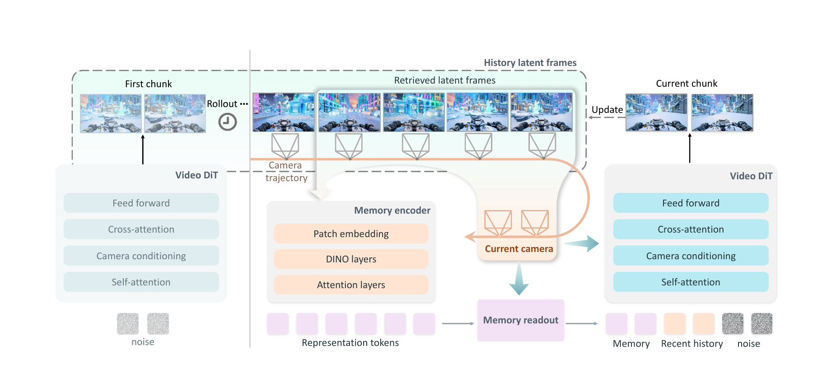

# WorldCrafter：回到旧地点时，视频世界还记得什么

作者：Yu, Wangbo、Liu, Kunhao、Hu, Wenbo、Yuan, Shenghai、Feng, Chaoran、Zhou, Haiyang、Huang, Yukun、Wang, Yiran、Zhao, Wang、Luo, Yingmin、Shan, Ying。arXiv:2609.24984 v1，2026-09-21。预印本，未宣称录用。

入选：新近创新；热度待验证。已读核心原文，本站未复现。

视频逐段生成时，最近几帧通常记得住，较早离开的场景却容易变化。WorldCrafter 把历史画面及其相机位置编码成紧凑记忆，再根据接下来要去的视角读出相关内容。它不是每一步都重建完整三维场景，也不是无条件把全部历史帧塞回模型。

具体做法是保留最近历史帧，再选八个能共同覆盖目标区域的历史帧；编码后读出相当于四帧 token 量的记忆，与近期上下文、当前噪声视频共同输入生成器。相机引导的读出优于不看目标视角的固定压缩，消融也比较了联合训练、历史帧选择与直接上下文记忆。

作者构造 145 张起始图、每图五条轨迹，共 725 段每方法生成的视频，包含动态和静态场景与闭环回访。所有方法接收相同起始图、文字和目标轨迹，输出统一缩至 640×384 评估；但部分基线是全步模型，部分是蒸馏模型，不能把所有结果当成等计算预算竞争。回访对照中，WorldCrafter 相对 Lyra 2.0 的 LPIPS 从 0.487 降至 0.255，PSNR 从 14.050 升至 18.016dB。

原文的 21.7 倍只比较记忆处理组件，排除了共享 VAE 解码与视频去噪，不是整体生成加速。蒸馏版报告四 GPU 下 16fps，也不是消费级单卡结论。其新价值在于把“以后会看哪里”用于分配有限记忆；真实世界动力学、几何估计误差与长时开放交互仍需继续检验。

作者方法图。历史画面先写入记忆，目标相机位置参与读出，所得记忆再进入视频生成。重点看“写入”与“按目标视角读取”的区别；CC BY 4.0 原图。（[作者原图](https://arxiv.org/abs/2609.24984v1)；[查看大图](../../../frontiers/2026/09/2026-09-23/images/paper-worldcrafter.png)。）

[原始论文](https://arxiv.org/abs/2609.24984v1) · [版本许可](http://creativecommons.org/licenses/by/4.0/)

此版本许可允许再分发（CC BY 4.0 或 CC0，见下方原始许可），本站保存未经修改的原始 PDF，保留作者、版本和来源。
[归档 PDF](2609.24984v1.pdf)

[返回本期论文精选](../../../frontiers/2026/09/2026-09-23/03-论文精选.md)
