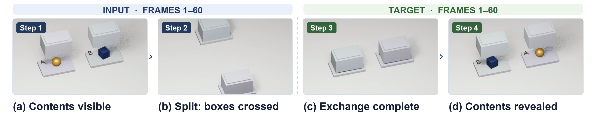

# WROP：看不见的物体，还应当留在世界里

作者：Zhang, Haotian、Yu, Fengyuan、Luo, Dezhi、Sun, Haoran、Zhao, Zehong、Gao, Qingying、Li, Yihan、An, Siyuan、Qin, Huayi、Zhang, Yilan、Jiang, Zhengze、Feng, Pinyuan、Zhang, Renrui、Guo, Ziyu、Wang, Letian、Yang, Mengyue、Mei, Kangfu、Wang, Maijunxian、Ji, Ran、Kumar, Vikash、Shi, Freda、Sripada, Chandra、Muller, Vincent C.、Torr, Philip、Yuille, Alan、Kriegeskorte, Nikolaus、Juefei-Xu, Felix、Zhang, Lvmin、Chen, Jieneng、Du, Yilun、Deng, Hokin。arXiv:2609.28654 v1，首发2026-09-23。预印本。

新近创新 / 新近实用；热度待验证。已读核心原文，本站未复现。

物体被盒子盖住以后，视频模型常把它当成消失了，或把它留在原来的屏幕位置。WROP把这种“物体恒存”拆成150个可生成任务，覆盖遮挡、容器、阻挡、下落、碰撞等六类情形，构造150万段样本。模型需要根据前半段视频，续写隐藏对象后来应当出现在哪里。

这些场景用Blender关键帧和作者设计的规则生成，并不是一个自动保证物理正确的通用引擎。训练与测试共享任务生成器家族，主要考察参数变化后的泛化；不能据此说模型已经学会所有现实物理。作者从Cosmos 3 Nano出发训练16B的PWM，低分辨率续写实验使用320×192输入、57帧前缀与60帧输出。

人工比较覆盖14个系统，20名评审给出361组不同的视频对判断。PWM的Bradley–Terry排名分约1680，整体第三、视频续写类第一；但排名更高的部分系统接受参考图和编辑指令，输入接口并不相同。又因为模型架构、预训练与数据不同，这个排名不能单独证明WROP训练造成了全部优势。

现在值得借鉴的是可检查的遮挡诊断，而非一个总排名。作者报告公开数据与训练材料，本期核对论文及源文件，未运行模型；复现应固定输入接口，另测未见生成器、长时间遮挡和自然视频，观察错误能否随着时间积累被纠正。

作者的盒子交换示例原图。沿时间方向追踪被遮挡的小物体：它应跟随容器移动，而不是固定在原屏幕坐标。图用于说明测试要求，不能把某一示例当成全体成功率。CC BY 4.0。（[作者原图](https://arxiv.org/abs/2609.28654v1)；[查看大图](../../../frontiers/2026/09/2026-09-26/images/wrop-boxes.png)。）

[原始论文](https://arxiv.org/abs/2609.28654v1) · [版本许可](http://creativecommons.org/licenses/by/4.0/)

采用CC BY 4.0，归档未改动的原版PDF，保留作者、版本和许可。
[归档PDF](2609.28654v1.pdf)

[返回本期论文精选](../../../frontiers/2026/09/2026-09-26/03-论文精选.md)
