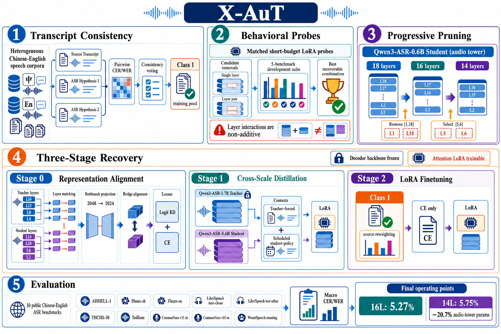

# X-AuT：先试删层组合，再逐步恢复语音识别能力

原题：X-AuT: Progressive Audio-Encoder Compression for Speech LLMs with Cross-Scale Distillation

作者：Haojun Zhang、Yi Zou、Min Chen、Qize Yu、Lianrui Fan、Xini Ding、Hao Li、Shuchang Zhou、Xianming Liu、Shiyu Huang

[arXiv:2609.11412v1](https://arxiv.org/abs/2609.11412v1) · 2026-09-10T11:43:17Z 提交 · v1 预印本。本站阅读记录：2026-09-12。

## 研究问题与方法

语音模型删掉编码器层后，送入语言解码器的表示会改变，可能出现漏字或过早结束。X-AuT 先用短训练探针比较删层组合，再按 18→16→14 逐步压缩 Qwen3-ASR-0.6B 的音频塔。单层表现好的两个删除位置，合在一起未必好，所以不能只排序单层分数。

每一步都先对齐表示，再用较大的 Qwen3-ASR-1.7B 教师恢复输出分布，最后做目标领域 LoRA 微调。语言解码器的基础权重保持冻结，但注意力 LoRA、部分阶段的共享输出嵌入会训练；把它概括成“只训音频编码器”并不准确。数据按多个转写结果的一致性筛选，一致不代表必然正确。

图｜来源原图。Haojun Zhang 等，原文 Figure 2。上排看数据筛选与删层，下一排看恢复：表示对齐 → 跨规模教师蒸馏 → LoRA 微调。18→16→14 只发生在音频编码器。最下方 20.7% 也是音频塔参数减少比例，不是整个语音模型的体积或端到端加速比例。 原图按 CC BY 4.0 引用。 [原始来源](https://arxiv.org/abs/2609.11412)。点击图片查看原尺寸。

## 实验、结果与边界

在十个中英文基准的宏平均 CER/WER 上，原 18 层为 5.61%，16 层为 5.27%，14 层为 5.75%；14 层音频塔参数少 20.7%。直接从 18 层删到 14 层的对照为 6.73%，支持分步恢复在这套配置中的作用。

这些是单次运行结果，未给多种子不确定性，检查点选择使用的开发子集也较小。0.14 个百分点的差距应作为描述性结果。完整部署还要测首 token、解码时间和不同音频长度；只压缩音频塔不会同比加速整个系统。本文为预印本，本站未复现训练。

## 复现时优先检查

- 组合删层是否优于单层排序后直接删除？
- 教师强度与剪枝本身的收益能否分离？
- 参数减少是否转化为可重复的端到端延迟改善？

## 原文与归档

[站内固定版本 PDF](2609.11412v1.pdf) · [原始 PDF](https://arxiv.org/pdf/2609.11412v1)。arXiv 页面标注 [CC BY 4.0](https://creativecommons.org/licenses/by/4.0/)，本地归档保留完整原文、作者署名与原始许可，未修改 PDF。

[返回 9 月 12 日论文精选](../../../frontiers/2026/09/2026-09-12/03-论文精选.md)
