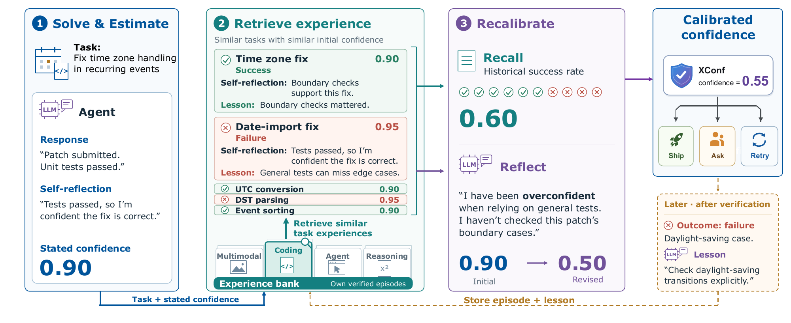

# XConf：拿自己的历史成败校准现在的把握

作者：Zhang, Caiqi、Zhu, Xiaochen、Li, Chengzu、Chen, Yulong、Kumaran, Dharshan、Collier, Nigel。arXiv:2609.17708 v1，2026-09-15；本期按预印本阅读，不宣称已录用。

[原始论文](https://arxiv.org/abs/2609.17708v1) · [版本许可](http://creativecommons.org/licenses/by/4.0/)

入选：新近创新。已读原文方法与实验；本站未复现。

模型说“我有九成把握”，并不代表类似回答有九成正确。XConf让系统保存过去任务、给分前的反思、初始置信度、验证结果及给分后的教训。面对新任务，先完成一次回答，再检索相关历史，最后修正置信度；当前任务的结果必须等之后验证才进入经验库。

方法分为Recall与Reflect。前者根据任务与初始置信度检索相似经历，用约50个近邻的成败率估计当前可靠性；后者把这些经历和教训交回模型，让它判断自己是否重复了过去的失误，再调整分数。最终组合两类估计。所谓免训练指不更新大模型权重，检索度量仍利用带结果的历史库拟合，绝非不需要标注。

实验覆盖四种模型、九类推理、代码、多模态与Agent基准。与十次自一致性采样相比，作者报告24个主表比较中23个胜出或打平，但事实短答类仍有落后。一个MMLU-Pro设置中，Gemini2.5的ECE由口头置信度0.117降到XConf的0.024；该数值只描述对应设置，不能推广成所有任务的错误率。

五折轮换保证每个估计的经验库来自其他折，额外实验还按真实时间先后增长经验库。置信度好不好不只看均值：作者一起报告校准、区分正确错误以及选择性回答的指标，避免把所有分数压成一个常数也说成成功。

成本优势来自少生成候选，但检索、反思与构建已评分历史仍有成本。换模型、跨领域或模型持续改进时，旧经历可能不再适用，遗忘策略仍待研究。本站的[技术实践](05-技术实践.md)用分离的合成历史与留出样本解释这一思路，不是XConf复现或大模型质量评测。

作者方法示意：先解答与自评，再查历史，分别计算成败率与反思，最后组合。图中的0.90、0.60、0.50和0.55是解释流程的示例；新任务真实结果在右下角之后才写入经验库。（[作者原图](https://arxiv.org/abs/2609.17708v1)；[查看大图](../../../frontiers/2026/09/2026-09-18/images/paper-xconf.png)。）

原始 PDF 按版本所列 http://creativecommons.org/licenses/by/4.0/ 保存，未改动内容。

[打开本站归档 PDF](2609.17708v1.pdf)

[返回本期论文精选](../../../frontiers/2026/09/2026-09-18/03-论文精选.md)
